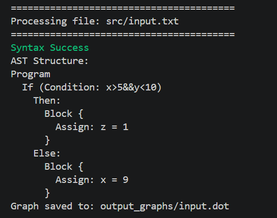

#  Control Flow Syntax Analyzer & Parser

##  Project Overview
The **Control Flow Syntax Analyzer & Parser** is a compiler front-end project that analyzes and validates structured programming constructs such as `if`, `if-else`, and `for` statements.

It uses **ANTLR (ANother Tool for Language Recognition)** with Java to build a **Context-Free Grammar (CFG)**, perform syntax analysis, and generate an **Abstract Syntax Tree (AST)**.

The system also provides **error detection and visualization using Graphviz**.

---

##  Features

- Lexical Analysis (Tokenization)
- Syntax Analysis using CFG
- Support for:
  - if statements
  - if-else statements
  - for loops
  - nested structures
- Abstract Syntax Tree (AST) generation
- Graph visualization using Graphviz (.dot files)
- Detailed syntax error reporting
- Test mode for batch validation (valid & invalid inputs)

---

##  Technologies Used

- Java
- ANTLR 4
- Graphviz
- Object-Oriented Programming (OOP)

---

## System Workflow

Input Code → Lexer → Parser → AST Builder → Error Checking → Graph Generation

---

##  How to Run the Project

### 1️⃣ Generate ANTLR Parser
```bash
java -jar lib/antlr-4.13.2-complete.jar -visitor -o src/parser grammar/ControlFlow.g4
```

### 2️⃣ Compile Project
```bash
javac -cp ".;lib/antlr-4.13.2-complete.jar" src/*.java src/parser/*.java src/visitor/*.java src/error/*.java utils/*.java
```

### 3️⃣ Run on Single Input File
```bash
java -cp ".;lib/antlr-4.13.2-complete.jar;src" Main
```

### 4️⃣ Run Test Files
```bash
java -cp ".;lib/antlr-4.13.2-complete.jar;src" Main --test
```

---

##  Sample Inputs & Outputs

### ✔️ Valid Input Example
```c
if (x > 5 && y < 10) {
    z = 1;
}
else 
{
    x=9;
}
```


---

### 🌳 Output (AST-image)


---
---

### 🌳 Output (Graph-image)


---

### ❌ Invalid Input Example
```c
for (i = 0 i < 10 i = i + 1) 
{ 
    x = 1; 
    
}
```
###  Invalid Input Screenshot 


---


##  Team Members

- Aya Mohamed  
- Nadia Kamel  
- Hanin Mustafa  

## Supervisor

- Dr. Rania Zeidan  

---

##  Future Improvements

- Semantic analysis layer
- Intermediate Code Generation
- Optimization phase
- GUI visualization
- Extended language support

---

##  Notes

All generated AST graphs are saved in:
```
output_graphs/
```

---

## 📖 Summary

This project demonstrates the full pipeline of a compiler front-end using ANTLR, including lexical analysis, parsing, AST generation, error handling, and visualization.

